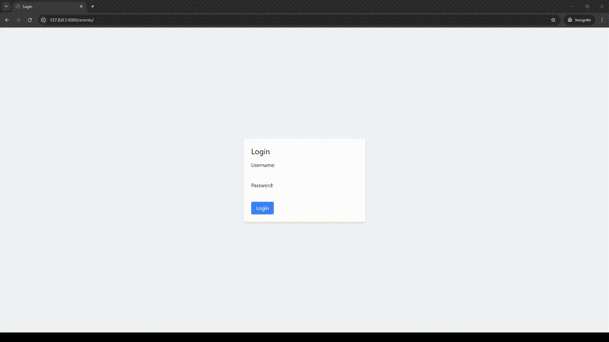

# 📅 **Event Management System (Django App)** 📅

## Project Overview
 
A simple event management system built with Django for event creation and management. The app uses SQLite as the database, Django Templates for rendering the frontend, and Tailwind CSS for styling.

## Prerequisites
- **Python 3.x**: Ensure you have [Python 3.x](https://www.python.org/downloads/) installed.

## Building and Running

1. **Clone the repository**:
   ```bash
   git clone https://github.com/GitEagleY/Event-Management-System.git
   cd Event-Management-System
   ```

2. **Create a virtual environment**:
   ```bash
   python -m venv venv
   source venv/bin/activate    # On Unix
   venv\Scripts\activate        # On Windows
   ```

3. **Install dependencies**:
   ```bash
   pip install -r requirements.txt
   ```

4. **Run database migrations**:
   ```bash
   python manage.py migrate
   ```

5. **Run the development server**:
   ```bash
   python manage.py runserver
   ```

6. **Access the app**:
   Navigate to `http://127.0.0.1:8000/` in your browser.

## Technologies Used
- **Backend**: Django
- **Database**: SQLite
- **Frontend**: Django Templates, Tailwind CSS

## Folder Structure
```
/event_management       # Main project settings folder
/events                 # Main project app folder
/venv                   # Virtual environment
/db.sqlite3             # SQLite database
```

## Contributions
Feel free to fork the repository, create a feature branch, and submit a pull request!


